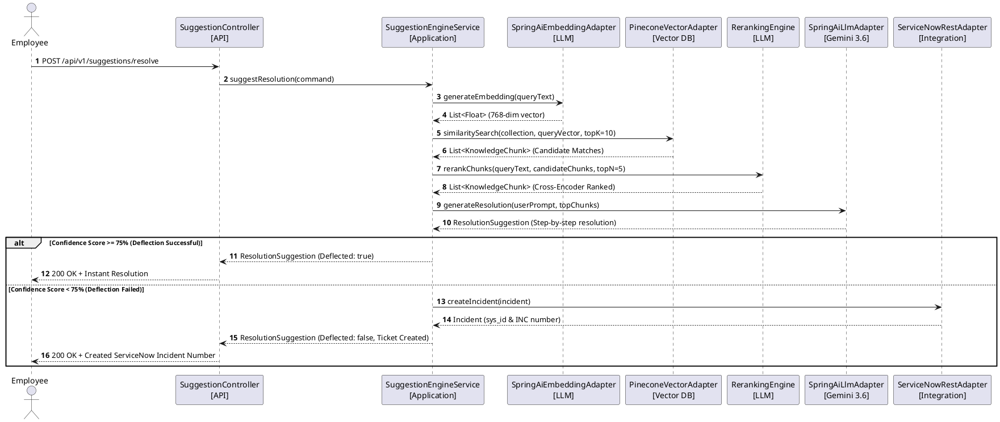

# Enterprise Architecture & Design Specifications

## 1. System Context Diagram (PlantUML)

```plantuml
@startuml SystemContext
!include https://raw.githubusercontent.com/plantuml-stdlib/C4-PlantUML/master/C4_Context.puml

Person(user, "Employee / Self-Service User", "Submits IT issues or queries via ServiceNow portal")
System(platform, "AI Service Desk Platform", "Spring Boot 3.5 Hexagonal Architecture Platform")
System_Ext(servicenow, "ServiceNow Enterprise", "ITSAM Incident & Knowledge API")
System_Ext(pinecone, "Pinecone Vector DB", "768-dim Vector Embeddings Index")
System_Ext(llm, "Google AI / Gemini 3.6 Flash", "Generative LLM & Reranker Engine")

Rel(user, platform, "1. Types issue before ticket submission", "HTTPS / REST")
Rel(platform, pinecone, "2. Query similarity search Top-K", "gRPC / REST")
Rel(platform, llm, "3. Cross-encoder rerank & RAG resolution synthesis", "Spring AI REST")
Rel(platform, user, "4. Return step-by-step resolution & confidence score", "JSON Response")
Rel(platform, servicenow, "5. Create incident IF unsolved (Deflection Fail)", "OAuth2 REST API")
@enduml
```

---

## 2. Hexagonal Architecture & Package Layout

```
                                +-----------------------------------+
                                |            API LAYER              |
                                |  (SuggestionController, OpenApi) |
                                +-----------------+-----------------+
                                                  |
                                                  v
                                +-----------------+-----------------+
                                |        APPLICATION LAYER          |
                                | (SuggestionEngineService, CQRS)   |
                                +-----------------+-----------------+
                                                  |
                                                  v
                                +-----------------+-----------------+
                                |           DOMAIN LAYER            |
                                |  (Entities, ValueObjects, Ports) |
                                +--+--------------+--------------+--+
                                   |              |              |
           +-----------------------+              |              +-----------------------+
           |                                      |                                      |
           v                                      v                                      v
+----------+----------+                +----------+----------+                +----------+----------+
| INTEGRATION/PINECONE|                | INTEGRATION/SERVICENOW|                |   INTEGRATION/LLM    |
| VectorDatabasePort  |                |   ServiceNowPort    |                | LlmPort & Embeddings |
+---------------------+                +---------------------+                +---------------------+
```

---

## 3. Primary AI Deflection Sequence Diagram (PlantUML)



---

## 4. Resilience4j Circuit Breaker & Fallback Architecture

- **Circuit Breaker States**: `CLOSED` -> `OPEN` on 50% failure rate over sliding window of 10 requests.
- **Fallback Behavior**: When ServiceNow REST API is unresponsive, incidents are buffered into a local persistent queue (`sys_id_queued_offline`) and automatically retried once connection health recovers.
- **Rate Limiting**: Configured with Token Bucket algorithm limiting peak burst to 100 requests/sec per client API key.

---

## 5. Security & Audit Logging Model

- **Authentication**: Stateless JWT token header (`Authorization: Bearer <token>`).
- **Authorization**: Role-Based Access Control (`ROLE_ENTERPRISE_USER`, `ROLE_KNOWLEDGE_ADMIN`).
- **Audit Trails**: Aspect-Oriented Programming (`AuditLogAspect`) wraps every application service call, recording correlation IDs, execution durations, user emails, and success/failure status in PostgreSQL audit tables.
