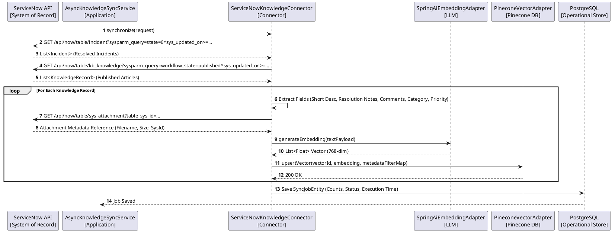

# Enterprise AI Knowledge Synchronization Platform - Architecture Specifications

## 1. Enterprise Synchronization High-Level Context (PlantUML)

```plantuml
@startuml SystemContext
!include https://raw.githubusercontent.com/plantuml-stdlib/C4-PlantUML/master/C4_Context.puml

Person(user, "Employee / Helpdesk Agent", "Creates incidents or searches resolutions")
System(platform, "Enterprise AI Knowledge Synchronization Platform", "Spring Boot 3.4 Multi-Module Platform")
System_Ext(servicenow, "ServiceNow Enterprise", "System of Record (Incidents, KB Articles, Attachments Metadata)")
System_Ext(pinecone, "Pinecone Vector DB", "Semantic Knowledge Index ('servicedesk-knowledge')")
System_Ext(llm, "Google AI / Gemini 3.6 Flash", "Generative RAG & Deflection Engine")
System_Ext(postgres, "PostgreSQL Database", "Operational Storage (Connector Configs, Sync History, Audit Logs)")

Rel(servicenow, platform, "1. Synchronize resolved incidents & KB articles (Incremental)", "OAuth2 REST / HTTPS")
Rel(platform, postgres, "2. Store sync job status, connector configs & metadata references", "JDBC / JPA")
Rel(platform, pinecone, "3. Upsert semantic embeddings & metadata tags", "REST / gRPC")
Rel(user, platform, "4. Pre-ticket query for instant resolution", "REST API")
Rel(platform, pinecone, "5. Metadata-filtered vector similarity search", "gRPC")
Rel(platform, llm, "6. Synthesize step-by-step deflection response", "REST / Spring AI")
Rel(platform, user, "7. Real-time AI suggestion with confidence score & references", "JSON Response")
Rel(platform, servicenow, "8. Fetch attachment binary on-demand via proxy", "Attachment REST API")
@enduml
```

---

## 2. Connector-Based Architecture Layout

```
                                +-----------------------------------+
                                |            API LAYER              |
                                | (ConnectorController, ServiceNow) |
                                +-----------------+-----------------+
                                                  |
                                                  v
                                +-----------------+-----------------+
                                |        APPLICATION LAYER          |
                                |  (AsyncKnowledgeSyncService)      |
                                +-----------------+-----------------+
                                                  |
                                                  v
                                +-----------------+-----------------+
                                |        CONNECTOR REGISTRY         |
                                |   (KnowledgeConnector Interface)  |
                                +--+--------------+--------------+--+
                                   |              |              |
           +-----------------------+              |              +-----------------------+
           |                                      |                                      |
           v                                      v                                      v
+----------+----------+                +----------+----------+                +----------+----------+
|  ServiceNowConnector|                |    JiraConnector    |                | ConfluenceConnector |
|  (Resolved Incidents|                |  (Future Connector) |                |  (Future Connector) |
|   & KB Articles)    |                |                     |                |                     |
+---------------------+                +---------------------+                +---------------------+
```

---

## 3. Knowledge Extraction & Synchronization Pipeline (PlantUML)



---

## 4. Pinecone Index & Metadata Filtering Strategy

- **Single Primary Index**: `servicedesk-knowledge`
- **Avoid Year-based Namespaces**: Namespaces are reserved strictly for Tenant, Workspace, or Environment isolation.
- **Metadata Filters Used**:
  - `workspace`: e.g. "Enterprise IT"
  - `category`: e.g. "Software", "Network", "Identity & Access"
  - `department`: e.g. "IT Infrastructure", "Security"
  - `priority`: e.g. "1 - Critical", "2 - High", "3 - Moderate"
  - `year`: e.g. "2026"
  - `documentType`: `INCIDENT` or `KNOWLEDGE_ARTICLE`
  - `connectorType`: `SERVICENOW`

---

## 5. Storage Principles

| Component | Storage Role | Policy |
|---|---|---|
| **ServiceNow** | System of Record | Holds full Incidents, Articles, Binary Attachments (PDF, Word, Images) |
| **PostgreSQL** | Operational Database | Stores Connection Configs, OAuth Tokens, Sync Jobs, Metadata References, Audit Logs |
| **Pinecone** | Semantic AI Index | Stores Vectors, Chunk Text, Metadata Filter Tags. NO Binary files or whole PDFs |
