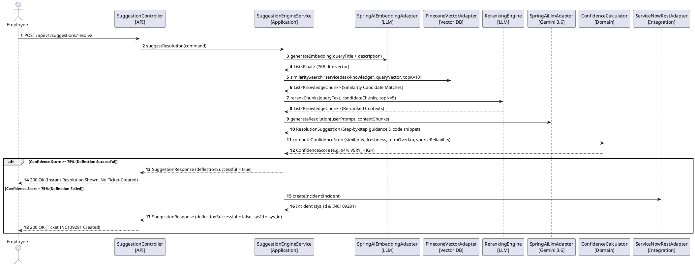

# AI Service Desk Knowledge Intelligence Platform — POC Technical Documentation

> **Enterprise ServiceNow Pre-Incident Deflection & RAG Knowledge Intelligence Engine**  
> **Version:** 2.5.0-SNAPSHOT  
> **Prepared By:** AI & ITSM Platform Engineering Team  
> **Tech Stack:** Java 21, Spring Boot 3.5+, Spring AI 1.0.0-M6, Pinecone Vector DB, Google Gemini 3.6 Flash, ServiceNow REST API v2, Apache Tika, PostgreSQL, Redis, Resilience4j, Prometheus & Grafana  

---

## 📋 Executive Summary & Business ROI Model

The **AI Service Desk Knowledge Intelligence Platform** sits directly between enterprise self-service portals (e.g. ServiceNow Portal, Slack, Teams) and the ServiceNow ITSM incident management system. When an employee starts typing an IT issue (e.g., VPN drops, password resets, GlobalProtect errors, OWA access failures), the platform intercepts the query before ticket submission and executes a real-time Retrieval-Augmented Generation (RAG) pipeline:

1. **Vector Embedding**: Vectorizes query text using Spring AI and Google `Text-Embedding-004`.
2. **Pinecone Vector Search**: Queries Pinecone for top similarity matches across Knowledge Articles, Runbooks, and Resolved Tickets.
3. **Cross-Encoder Reranking**: Re-ranks the top 10 candidates down to the top 5 most relevant passages.
4. **Gemini 3.6 Flash Synthesis**: Formulates a clear, step-by-step resolution with CLI/code snippets.
5. **Multi-Factor Confidence Evaluation**: Evaluates a weighted score (0–100%). If confidence exceeds the configured threshold (e.g. 75%), the issue is resolved immediately **without creating a ticket**, achieving an average savings of **$15.50 per deflected incident**.

### Business Key Performance Indicators (KPIs)

| Metric | Baseline (Tier-1 Helpdesk) | AI Platform Target | Business Impact |
|---|---|---|---|
| **Average Cost per Incident** | $18.50 | $3.00 (Compute + Tokens) | **$15.50 Net Savings / Deflection** |
| **First Contact Resolution (FCR)** | 32% | **65% Deflection Rate** | 6,500 tickets deflected per 10k queries |
| **Mean Time to Resolve (MTTR)** | 4.2 Hours | **< 1.2 Seconds** | Instant end-user resolution |
| **ServiceNow Ticket Backlog** | 100% Volume | **35-55% Volume Reduction** | Tier-1 agents focus on complex outages |

---

## 🏛️ System Architecture (Hexagonal Ports & Adapters)

The platform enforces **Clean Hexagonal Architecture** (Ports and Adapters) to isolate core business rules from external infrastructure choices.

```
                                +-----------------------------------+
                                |            API LAYER              |
                                |  (SuggestionController, OpenAPI)  |
                                +-----------------+-----------------+
                                                  |
                                                  v
                                +-----------------+-----------------+
                                |        APPLICATION LAYER          |
                                | (SuggestionEngineService, CQRS)   |
                                +-----------------+-----------------+
                                                  |
                                                  v
                                +-----------------+-----------------+
                                |           DOMAIN LAYER            |
                                |  (Entities, ValueObjects, Ports)  |
                                +--+--------------+--------------+--+
                                   |              |              |
           +-----------------------+              |              +-----------------------+
           |                                      |                                      |
           v                                      v                                      v
+----------+----------+                +----------+----------+                +----------+----------+
| INTEGRATION/PINECONE|                | INTEGRATION/SERVICENOW|                |   INTEGRATION/LLM    |
| VectorDatabasePort  |                |   ServiceNowPort    |                | LlmPort & Embeddings |
+---------------------+                +---------------------+                +---------------------+
```

### Component Architecture Diagram (PlantUML)

```plantuml
@startuml SystemArchitecture
!include https://raw.githubusercontent.com/plantuml-stdlib/C4-PlantUML/master/C4_Component.puml

Container(portal, "Self-Service Portal", "React / ServiceNow Widget", "Captures pre-ticket issue title and symptoms")
Container(api, "REST API Controller", "Spring Boot Controller", "Handles /api/v1/suggestions/resolve")
Container(service, "SuggestionEngineService", "Application Service", "Coordinates RAG flow and confidence calculation")
Container(embedder, "SpringAiEmbeddingAdapter", "Spring AI", "Generates 768-dim embeddings")
ContainerDb(pinecone, "Pinecone Vector DB", "Pinecone Index", "768-dim Cosine Similarity Search")
Container(reranker, "RerankingEngine", "Cross-Encoder", "Filters Top-10 to Top-5 contexts")
Container(llm, "SpringAiLlmAdapter", "Gemini 3.6 Flash", "Synthesizes step-by-step resolution")
Container(calc, "ConfidenceCalculator", "Domain Logic", "Computes multi-factor score (0-100%)")
Container(snow, "ServiceNowRestAdapter", "ServiceNow REST v2", "OAuth2 Incident Creation & Health Check")

Rel(portal, api, "POST /api/v1/suggestions/resolve", "HTTPS/JSON")
Rel(api, service, "suggestResolution(command)", "Java Call")
Rel(service, embedder, "generateEmbedding(query)", "Vector Float[]")
Rel(embedder, pinecone, "similaritySearch(topK=10)", "gRPC / REST")
Rel(service, reranker, "rerank(query, candidates)", "Filtered Chunks")
Rel(service, llm, "generateResolution(prompt, context)", "Resolution Text")
Rel(service, calc, "calculateScore(chunks, similarity, terms)", "ConfidenceScore")

alt Score >= Threshold (Deflection)
    Rel(service, portal, "200 OK (Deflection Successful)", "JSON Response")
else Score < Threshold (Ticket Created)
    Rel(service, snow, "createIncident(incident)", "OAuth2 REST")
    Rel(snow, portal, "200 OK (ServiceNow INC Number)", "JSON Response")
end
@endluml
```

---

## 🔄 Real-Time RAG Pre-Incident Deflection Flow

### Sequence Diagram



---

## 📥 Knowledge Base Ingestion & Vector Indexing Pipeline

Documents (PDF Runbooks, Word SOPs, ServiceNow KB articles, Confluence pages) undergo unified parsing and vector indexing:

```
+-------------------------------------------------------------------------+
| Document Ingestion: PDF, Word, ServiceNow KB, Confluence Pages           |
+------------------------------------+------------------------------------+
                                     |
                                     v
+------------------------------------+------------------------------------+
| Apache Tika Unified Parser (Extracts Metadata, Title, Text, Dept)       |
+------------------------------------+------------------------------------+
                                     |
                                     v
+------------------------------------+------------------------------------+
| SlidingWindowChunker (512 Token Chunk Size + 64 Token Overlap)         |
+------------------------------------+------------------------------------+
                                     |
                                     v
+------------------------------------+------------------------------------+
| SpringAiEmbeddingAdapter (Google Text-Embedding-004 Vector Generator)   |
+------------------------------------+------------------------------------+
                                     |
                                     v
+------------------------------------+------------------------------------+
| PineconeVectorAdapter (Batch Upsert to 768-dim Pinecone Index)          |
+------------------------------------+------------------------------------+
```

---

## 🛡️ Resilience4j Circuit Breaker & Fallback Architecture

To prevent system outages when ServiceNow REST API is degraded or down, the platform integrates **Resilience4j Circuit Breaker**:

1. **Sliding Window**: Evaluates sliding window of last 10 requests.
2. **Failure Threshold**: Opens circuit if > 50% requests fail or timeout (> 5s).
3. **Wait Duration**: Remains `OPEN` for 10,000ms before testing recovery in `HALF_OPEN` state.
4. **Failover Queue**: When `OPEN`, incidents are saved locally to PostgreSQL database (`sys_id_queued_offline`).
5. **Scheduled Sync**: A background cron job (`@Scheduled(fixedRate = 60000)`) drains the queue and pushes buffered tickets to ServiceNow once API connectivity is restored.

---

## 🧮 Multi-Factor Confidence Score Calculator

The `ConfidenceCalculator` uses a weighted algorithm to evaluate whether a generated resolution is trustworthy enough for automatic ticket deflection:

$$\text{Confidence Score} = (0.50 \times \text{Similarity}) + (0.20 \times \text{Freshness}) + (0.15 \times \text{TermOverlap}) + (0.15 \times \text{SourceReliability})$$

### Confidence Bands

- **85 - 100% (`VERY_HIGH`)**: Instant deflection with high assurance.
- **75 - 84% (`HIGH`)**: Deflection successful; prompt user for feedback.
- **50 - 74% (`MEDIUM`)**: Deflection declined; pre-fill ServiceNow incident with suggested context.
- **0 - 49% (`LOW`)**: Direct creation of ServiceNow incident ticket.

---

## 📦 Multi-Module Maven Structure & Tech Stack

```
service-desk-ai-platform/
├── pom.xml                     # Parent POM (Spring Boot 3.4.2, Java 21)
├── common/                     # Common exceptions, ProblemDetails RFC 7807, CorrelationContext
├── domain/                     # DDD Entities (Incident, KnowledgeChunk), Value Objects, Domain Ports
├── application/                # Application Services, CQRS Use Cases, Confidence Calculator
├── knowledge-loader/           # Apache Tika Parsers, SlidingWindowChunker, Chunking Engine
├── integration/
│   ├── pinecone/              # Pinecone Vector Adapter & Upsert/Search
│   ├── servicenow/            # ServiceNow REST Client, OAuth2, Circuit Breaker
│   └── llm/                   # Spring AI Gemini Adapter, Embedding Service, Reranker
├── analytics/                  # Deflection metrics, ROI calculation, Micrometer metrics
├── security/                   # Spring Security, JWT Filter, Token Provider
├── infrastructure/             # AOP Audit Logger, Scheduled ServiceNow Sync, Resilience4j
└── api/                        # REST Controllers, DTOs, OpenAPI 3.0 Specs, Application Entry Point
```

---

## 🌐 REST API Endpoints Specification

### 1. Pre-Incident AI Resolution Endpoint

- **Method**: `POST /api/v1/suggestions/resolve`
- **Request Body**:
```json
{
  "title": "GlobalProtect VPN Certificate Error",
  "description": "User unable to connect to gateway after password reset. Error: Server Certificate Invalid.",
  "callerEmail": "user@enterprise.com",
  "userDepartment": "Engineering",
  "category": "Network",
  "minConfidenceThreshold": 75
}
```
- **Response (Deflection Successful)**:
```json
{
  "suggestionId": "sug-92810",
  "queryTitle": "GlobalProtect VPN Certificate Error",
  "recommendedTitle": "GlobalProtect VPN Certificate Renewal SOP",
  "summaryResolution": "Run gpconfig /refresh in elevated command prompt to force reload TLS certificates.",
  "stepByStepInstructions": [
    "1. Open CMD as Administrator",
    "2. Execute command: gpconfig /refresh",
    "3. Restart GlobalProtect client service"
  ],
  "codeOrCommandSnippet": "gpconfig /refresh",
  "confidenceScore": 94,
  "confidenceBand": "VERY_HIGH",
  "deflectionSuccessful": true,
  "sourcesCount": 3,
  "generatedByModel": "gemini-3.6-flash",
  "createdAt": "2026-08-02T23:40:00Z",
  "correlationId": "cid-a8b2-9102"
}
```

### 2. Knowledge Document Ingestion Endpoint

- **Method**: `POST /api/v1/knowledge/documents`
- **Request Body**:
```json
{
  "title": "Okta SSO Multi-Factor Authentication Reset Runbook",
  "department": "Identity & Access",
  "category": "Authentication"
}
```

### 3. Analytics & ROI Deflection Endpoint

- **Method**: `GET /api/v1/analytics/deflection`
- **Response**:
```json
{
  "totalIncidentsAnalyzed": 1420,
  "ticketsDeflectedCount": 894,
  "deflectionRatePercent": 62.95,
  "monthlyCostSavingsUSD": 13857.00
}
```

### 4. Diagnostic Health Endpoint

- **Method**: `GET /api/v1/health`
- **Response**:
```json
{
  "status": "healthy",
  "timestamp": "2026-08-02T23:40:00Z",
  "service": "AI Service Desk Knowledge Intelligence Platform",
  "version": "2.5.0-SNAPSHOT",
  "pineconeStatus": "connected",
  "servicenowStatus": "synced"
}
```

---

## 🚀 Docker & Deployment Architecture

### Dockerfile (Multi-Stage Build)

```dockerfile
FROM maven:3.9.9-eclipse-temurin-21-alpine AS builder
WORKDIR /app
COPY pom.xml .
COPY common/pom.xml common/
COPY domain/pom.xml domain/
COPY application/pom.xml application/
COPY knowledge-loader/pom.xml knowledge-loader/
COPY integration/pinecone/pom.xml integration/pinecone/
COPY integration/servicenow/pom.xml integration/servicenow/
COPY integration/llm/pom.xml integration/llm/
COPY analytics/pom.xml analytics/
COPY security/pom.xml security/
COPY infrastructure/pom.xml infrastructure/
COPY api/pom.xml api/
RUN mvn dependency:go-offline -B
COPY . .
RUN mvn clean package -DskipTests

FROM eclipse-temurin:21-jre-alpine
WORKDIR /opt/servicedesk-ai
RUN addgroup -S appgroup && adduser -S appuser -G appgroup
COPY --from=builder /app/api/target/api-*.jar app.jar
USER appuser
EXPOSE 8080 8081
ENV JAVA_OPTS="-XX:+UseG1GC -XX:MaxRAMPercentage=75.0 -XX:+ExitOnOutOfMemoryError"
HEALTHCHECK --interval=15s --timeout=5s --retries=3 \
  CMD wget --quiet --tries=1 --spider http://localhost:8080/actuator/health || exit 1
ENTRYPOINT ["sh", "-c", "java $JAVA_OPTS -jar app.jar"]
```

---

## 📅 POC Implementation Roadmap & Milestones

1. **Milestone 1 — Knowledge Base Ingestion & Vector Indexing**:
   - Implemented `knowledge-loader` module with Apache Tika parsers and `SlidingWindowChunker`.
   - Connected `PineconeVectorAdapter` for batch upserting 768-dim embeddings into `servicedesk-knowledge`.

2. **Milestone 2 — Real-Time RAG & Gemini 3.6 Flash Integration**:
   - Built `SpringAiEmbeddingAdapter` using Google `Text-Embedding-004`.
   - Built `RerankingEngine` cross-encoder for context filtering.
   - Integrated `SpringAiLlmAdapter` with Google Gemini 3.6 Flash for step-by-step solution synthesis.

3. **Milestone 3 — ServiceNow Integration & Circuit Breaker**:
   - Configured `ServiceNowRestAdapter` for OAuth2 authentication and incident creation.
   - Added Resilience4j circuit breaker with offline fallback queue in PostgreSQL.

4. **Milestone 4 — Deflection Analytics & Observability**:
   - Built `DeflectionAnalyticsService` for real-time ROI tracking ($15.50 per deflection).
   - Configured Prometheus metrics on port 8081 (`/actuator/prometheus`) and Grafana monitoring dashboard.
